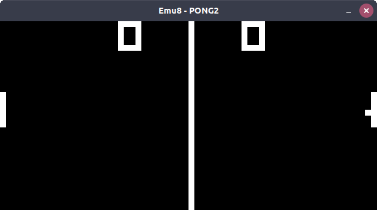

# Emu8
A simple CHIP8 emulator written in C, using SDL2.



### Usage:

    emu8 <ROM_file>
    
You can load hexadecimal roms files with the argumment ````-h <ROM_file>````.

### Build:

To build, you must have cmake installed in you OS, and run:

    ./clean
  
...and before:

    ./compile
    
The binary file is generated in build/src/ as emu8.
### Install:

If you want to install emu8, run:

    ./install
    
* Note: maybe you should run with superuser privileges, for example: ````sudo ./install````
